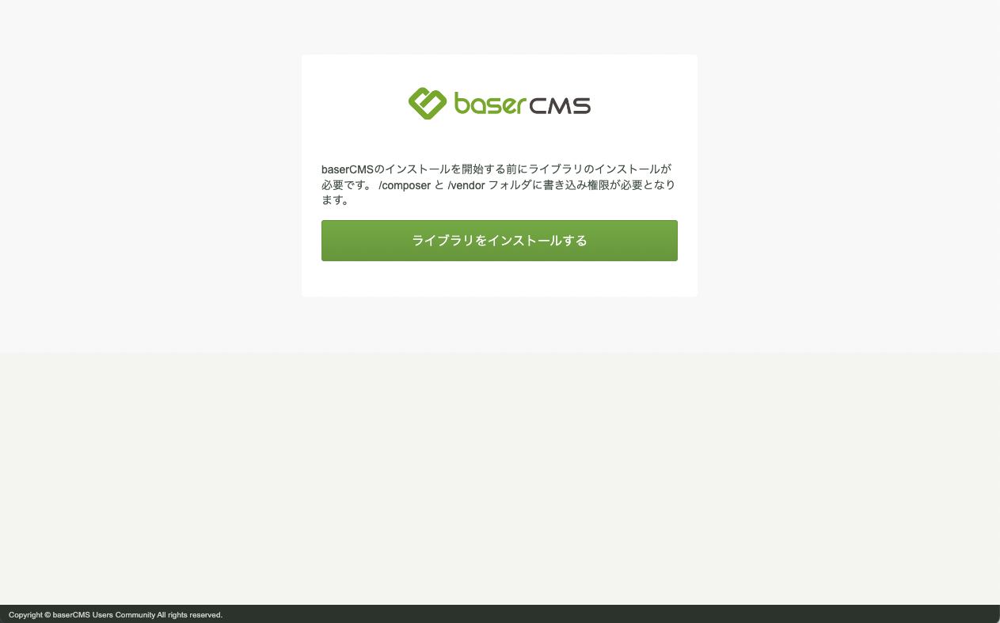
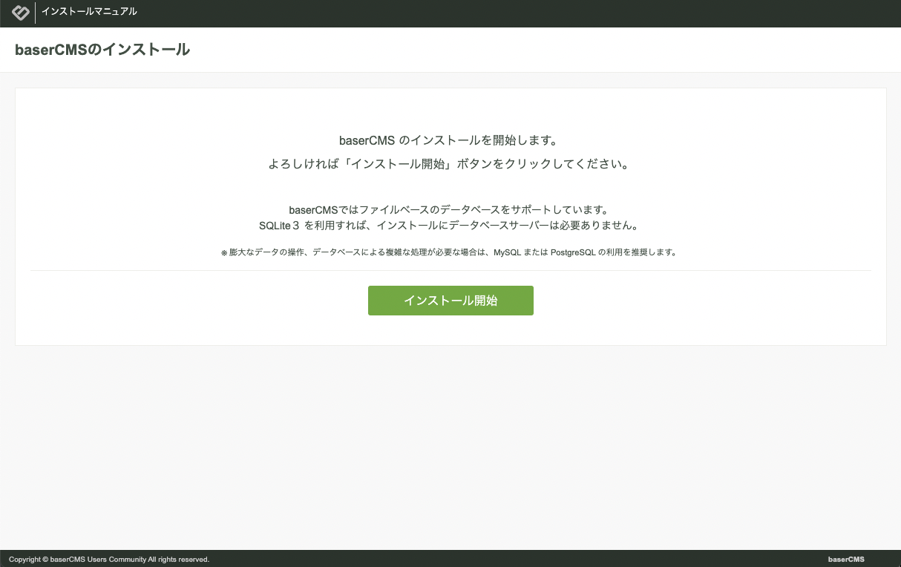
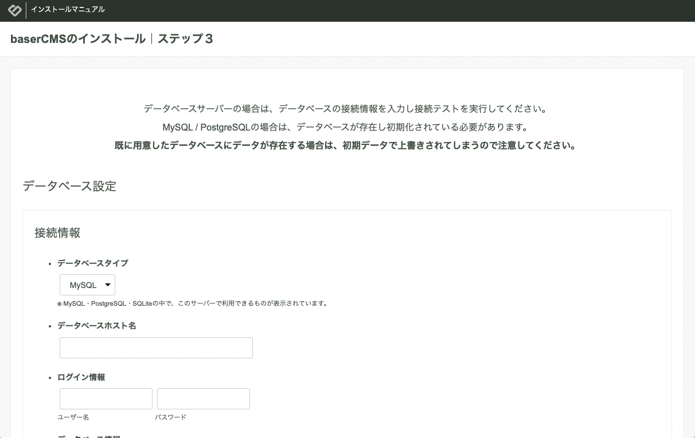

# インストールガイド

baserCMSはサーバーに設置するタイプの Webアプリケーションです。  
インストーラーが付属していますので簡単にインストールして利用できます。  

## インストールする環境を準備する
baserCMSをインストールするには次の３つの方法があります。  
どの方法においても、PHPが動作する環境が必要です。詳細については [システム要件](./system_requirements) をご確認ください。

### 1. ホスティングで利用する
レンタルサーバーなど、PHPが動作するサーバーであればほとんどの環境で動作します。  
- [ホスティングで利用する](./hosting)

### 2. ローカル環境を構築して利用する
ローカル環境ですぐに試せるよう Docker の環境を提供しています。
- [ローカル環境を構築して利用する](./build_local_env)

### 3. CakePHPのプロジェクトで利用する
baserCMSはCakePHPのプラグインとして動作します。 composer を利用する事で簡単に導入する事ができます。
- [CakePHPのプロジェクトで利用する](./use_for_cakephp)
  
## インストールを実行する
インストールする環境が準備できたら次の手順でインストールを進めます。

### インストーラーを起動

配置先のトップページにブラウザでアクセスするとライブラリのインストーラーが起動します。



　
### ライブラリのインストール

「ライブラリをインストールする」ボタンをクリックして、baserCMSに必要なライブラリをインストールします。  

ライブラリのインストールが完了すると、次は baserCMS のインストール画面に切り替わります。



「PHPのパス」に文字列が入っている場合には特に問題なく進めることができますが、空欄の場合には準備が必要です。

#### 「PHPのパス」が空欄の場合
内部的には、composer を利用して、CakePHPなど必要なライブラリをインストールしています。  
composer を利用するには、CLI版のPHPが必要となりますが、環境によっては、baserCMS側で、CLI版のPHPの実行パスが取得できない場合があります。  

インストーラー画面の「PHPのパス」が空の状態になっている場合は、CLI版のPHPの実行パスを調べてから手動で入力します。

CLI版のPHPの実行パスは、[PHP CLI のパス](./php_path) を参照してください。

例えば、2023/3/26 現在、ロリポップでは、次のパスとなりますので、「PHPのパス」に入力してから「ライブラリをインストールする」をクリックします。

```shell
/usr/local/php/8.1/bin/php
```
 
#### ライブラリのインストールがうまくいかない場合
「PHPのパス」を入力してもインストールがうまくいかない場合は、SSHでログインして手動で次のコマンドを実行してください。

```shell
# インストールしたディレクトリに移動し、PHPのパスを通した上で
curl -sS https://getcomposer.org/installer | php
./composer.phar self-update
./composer.phar install
cp config/.env.example config/.env
```
上記コマンド完了後に、配置先のトップページにブラウザで再度アクセスすると、baserCMSのインストール画面が表示されます。

　
### ステップ２：環境チェック
「インストール開始」ボタンをクリックすると、環境チェックが始まります。  
「基本必須条件」に赤色の文字が出てなければインストール可能な状態ですので、「次のステップへ」をクリックします。  
そうでない場合、画面の指示に従い設定を行い、「再チェック」をクリックします。


　
### ステップ３：データベース設定
データベースは、MySQL、PostgreSQL、SQLite を提供予定ですが、現在（2023/3/26）は、MySQLのみ対応している状況です。
次の情報を入力し、「接続テスト」ボタンをクリックします。

- データベースホスト名
- ユーザー名
- パスワード
- データベース名

baserCMSが提供する Docker を利用している場合は、データベース情報について、[ローカル環境を構築する](./build_local_env#データベース情報) の「データベース情報」を参照してください。



接続に成功したら、「次のステップへ」をクリックします。  
このタイミングでデータベースの構築が始まりますので少し時間がかかります。　

　 
### ステップ４：サイト名と管理ユーザー登録
サイト名と管理ユーザーの情報を入力して「登録」ボタンをクリックします。  
最後のセットアップが始まりますので少し時間がかかります。


　
### インストール完了
インストール完了です。お疲れさまでした。


トップページ、または、管理画面を開いて正常に動作しているか確認しましょう。


## 環境設定
baserCMSの管理画面は、https（SSL）でアクセスしないとエラーとなりますが、http でアクセスしたい場合など、環境設定を変更する事ができます。環境設定を変更したい場合はこちらをご覧ください。

- [環境設定](./env_setting)
　

## WordPressとの共存
baserCMSは WordPressと共存させることもできます。共存させたい場合はこちらをご覧ください。

- [WordPressとの共存](./coexist_with_wordpress)

## サブフォルダへの設置

- [サブフォルダに設置する](/5/ucmitz/etc/subfolder)
- [Dockerでサブフォルダの環境を作る](./build_local_env#docker-でサブフォルダの環境を作る)
