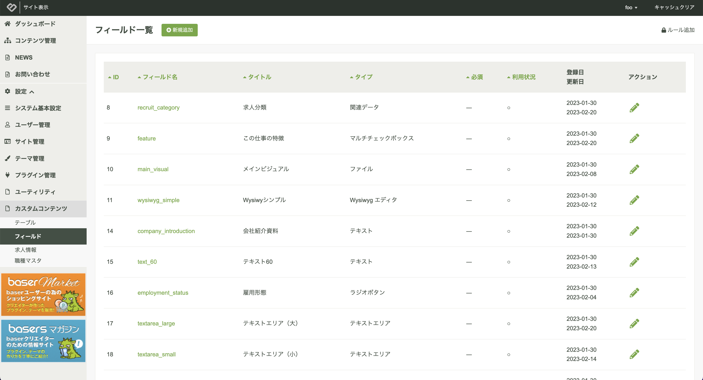
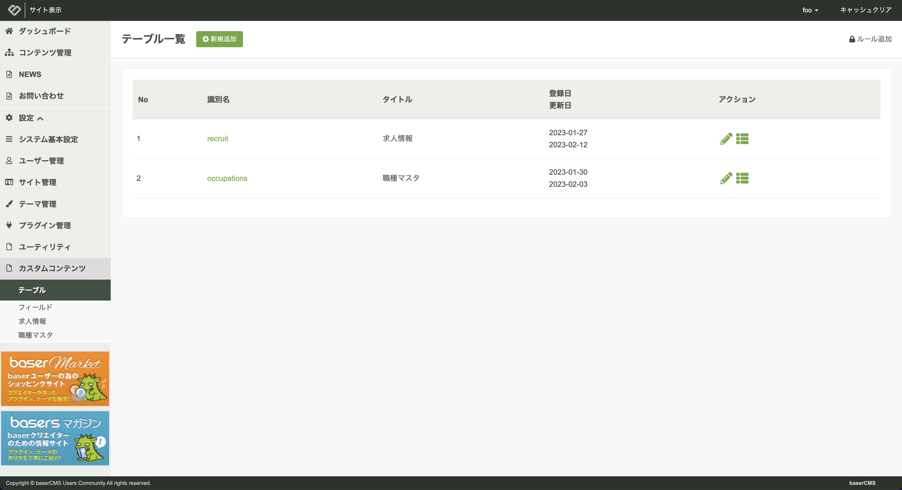
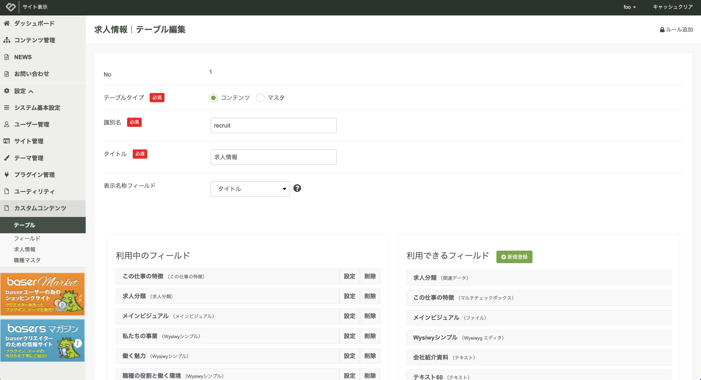
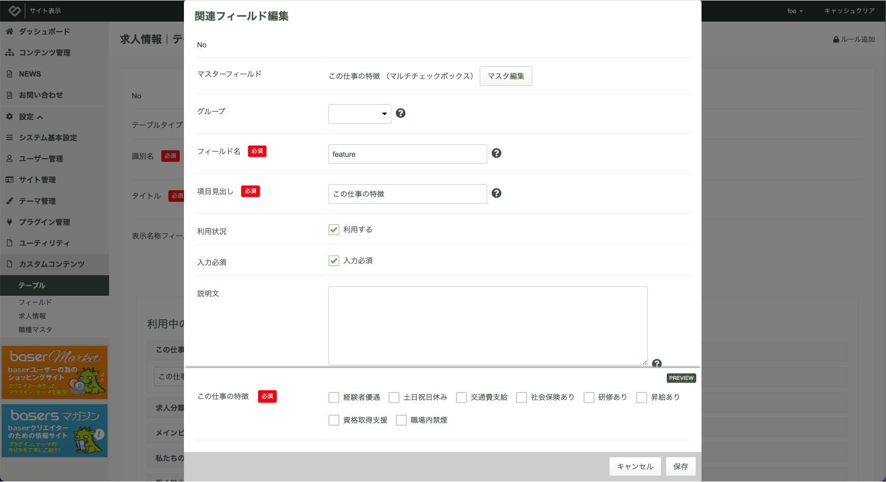
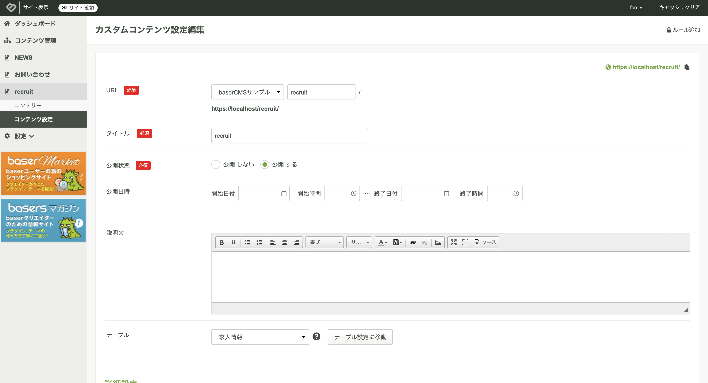
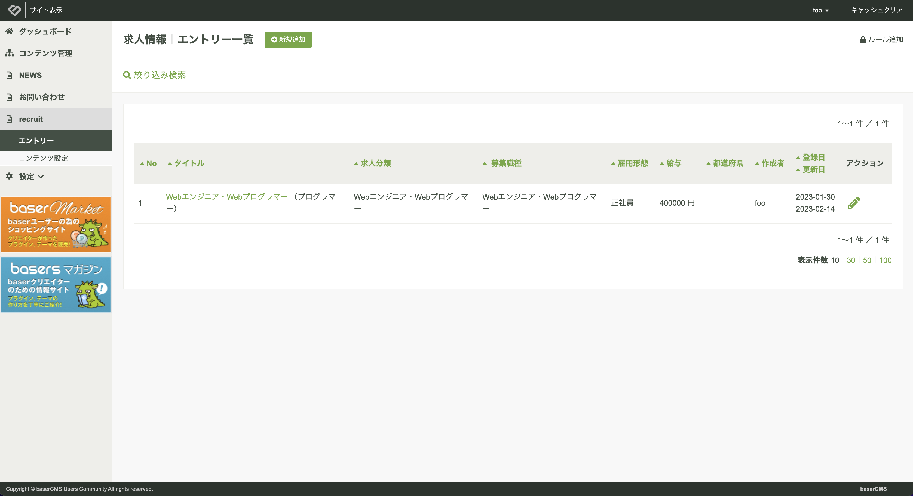
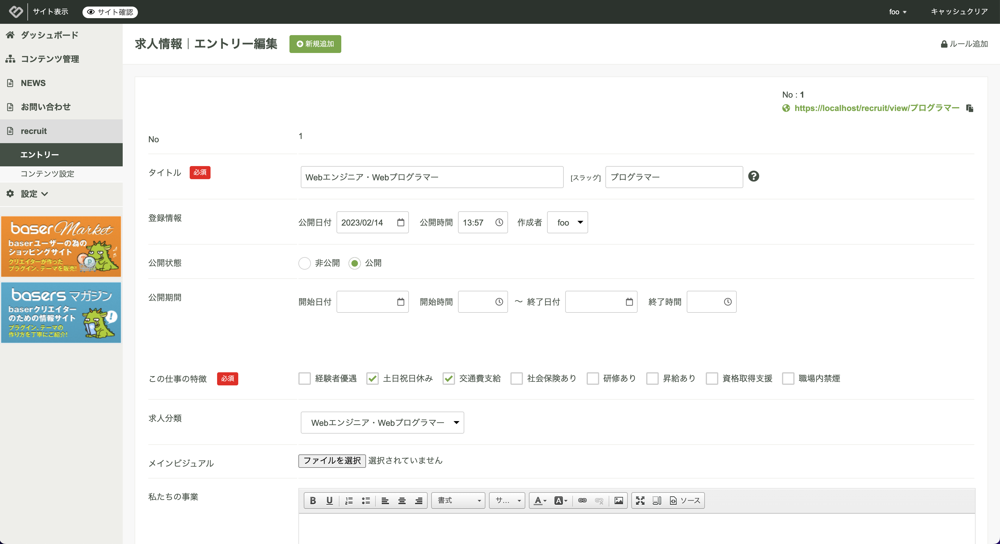

# カスタムコンテンツの利用方法

カスタムコンテンツは、独自のフィールドでコンテンツを設計できるプラグインです。  
ここでは簡単な利用例を記載します。詳細については、 [カスタムコンテンツ設計書](../specification/bc-custom-content/index) をご覧ください。

## カスタムコンテンツの作成の流れ

1. プラグインをインストールする
2. カスタムフィールドを定義する
2. カスタムテーブルを作成する
3. カスタムテーブルとカスタムフィールドを紐付ける
4. コンテンツ管理でカスタムコンテンツを作成する
5. カスタムコンテンツとカスタムテーブルを紐付ける
6. カスタムエントリーを登録する
7. フロントページを確認する

## 1. プラグインをインストールする

設定 → プラグイン管理より、BcCustomContent（カスタムコンテンツ）のインストールボタンをクリックし、インストールを実行します。

設定メニューの中に「カスタムコンテンツ」が追加されます。

## 2. カスタムフィールドを定義する

設定 → カスタムコンテンツ → フィールドより、フィールドの定義を行います。  



新規登録ボタンより新しいフィールドを定義します。  
タイプを選択し必要事項を入力すると画面下にコントロールのプレビューを表示します。


## 3. カスタムテーブルを定義する

設定 → カスタムコンテンツ → テーブルより、テーブルを作成します。



新しいテーブル名入力して一度保存すると、テーブルとフィールドの紐付けができるようになります。  
「利用できるフィールド」に先ほど定義したカスタムフィールドの一覧が表示されていますので、必要なものを「利用中のフィールド」にドラッグアンドドロップで移動します。

「利用中のフィールド」における並び順が、管理画面のカスタムエントリー入力画面の並び順となりますので、適宜、ドラッグアンドドロップで並び順を入れ替えます。



なお、「利用中のフィールド」のフィールドの「設定」をクリックすると名称を変更できます。

また、「詳細編集」ボタンをクリックする事で、入力必須や、説明文、注意書き、前見出し、後見出しなど、管理画面のカスタムエントリー入力画面の表示に関わる部分の設定ができ、こちらも画面下部でプレビューを確認する事ができます。



## 4. コンテンツ管理でカスタムコンテンツを作成する
作ったテーブルは、マスターメンテナンス用の管理画面としても利用する事ができますが、フロントページに表示するには、コンテンツ管理でカスタムコンテンツを作成し、テーブルと紐付ける必要があります

コンテンツ管理を開き、配置対象のフォルダを右クリックし、「カスタムコンテンツ」を選択します。


## 5. カスタムコンテンツとカスタムテーブルを紐付ける

カスタムコンテンツの編集画面を開き、「テーブル」にて先ほど作成したテーブルを選択し保存します。  
公開状態が「公開する」となっている場合、画面左のメニューにテーブル名を表示します。



## 6. カスタムエントリーを登録する
先ほど表示された画面左のメニューからエントリーを選択するとカスタムエントリーの一覧を確認できます。



新規登録をクリックすると新しいカスタムエントリーの登録画面に遷移します。  
カスタムテーブルで定義したフィールドで入力画面が構成されている事を確認できます。



## 7. フロントページを確認する

ツールバーの「サイト確認」、または、プレビューをクリックする事でフロントページを確認できます。  
なお、こちらのレイアウトは、自動生成したものになっています。  
実際には、テンプレート上でフロントページ用のヘルパ関数を利用して自由に項目を配置する使い方を想定しています。


テンプレートやヘルパ関数の詳細については、[フロントの記事詳細を表示する](../specification/bc-custom-content/custom_entries#フロントの記事詳細を表示する) を御覧ください。


なお、パンくずの上位ページをクリックすると一覧も自動生成されている事が確認できます。  
初期状態では、検索項目も自動生成しています。


## WebAPI

カスタムエントリーは、WebAPIからも取得が可能です。  
（事前にWebAPIの有効化が必要です）

エンドポイントは次のとおりです。
```shell
# 一覧
/baser/api/bc-custom-content/custom_entries.json?custom_table_id=1
# 詳細
/baser/api/bc-custom-content/custom_entries/1.json?custom_table_id=1
```

必ず、クエリパラメータに `custom_table_id` を指定する必要があります。

　
　


　　

