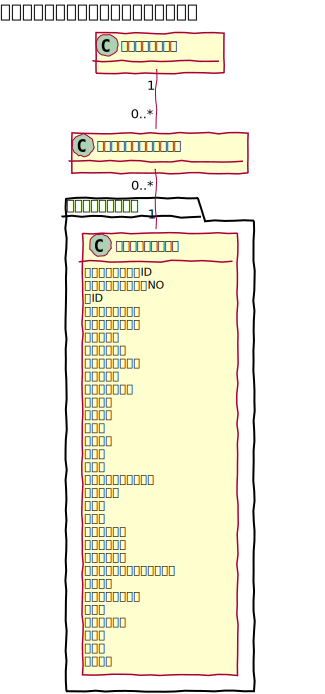
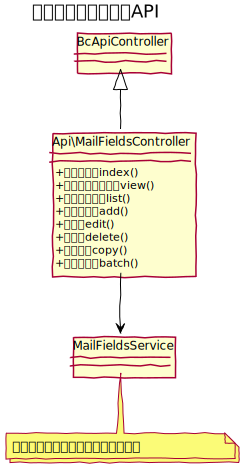

# カスタムフィールド設計書

独自コンテンツに対するフィールドを定義できる機能です。

## ユースケース図

　
## 管理機能
### 一覧
カスタムフィールドを一覧で表示する。
#### 有効化
カスタムフィールドを有効化する。
#### 無効化
カスタムフィールドを無効化する。
#### コピー
カスタムフィールドをコピーする。コピーの際、カスタムエントリーテーブルのフィールドも追加する。
#### 削除
カスタムフィールドを削除する。削除の際、メッセージテーブルのフィールドも削除する。
#### 並べ替え
カスタムフィールドの表示順を並べ替える。
#### 一括処理
一括処理として次の機能を提供する。
- 削除
- 有効化
- 無効化

### 新規追加
新しいカスタムフィールドを追加する。追加の際、カスタムエントリーテーブルのフィールドも追加する。  

### 編集
既存のカスタムフィールドの設定を編集する。編集の際、フィールド名が変更となった場合は、カスタムエントリーテーブルのフィールド名も変更する。

### 削除
既存のカスタムフィールドを削除する。削除の際に次の処理を行う。
- カスタムエントリー上の該当フィールド削除
- 該当フィールドに関連づく関連フィールドの削除

## フィールドタイプ　
テキスト、テキストエリア、ラジオボタンなどのフィールドタイプは、プラグイン内直下の plugins ディレクトリ内で、個別にプラグインとして管理する。

config.php において、`type` に `BcCustomContentPlugin` と定義すると、カスタムコンテンツプラグインで読み込む事ができるプラグインとして認識される。
 
独自のカスタムコンテンツプラグインも開発を可能とする。

　
## ドメインモデル図

　
## クラス図
### 管理画面

　
### API

