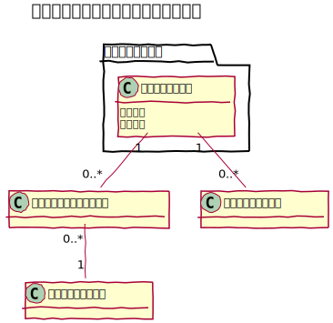
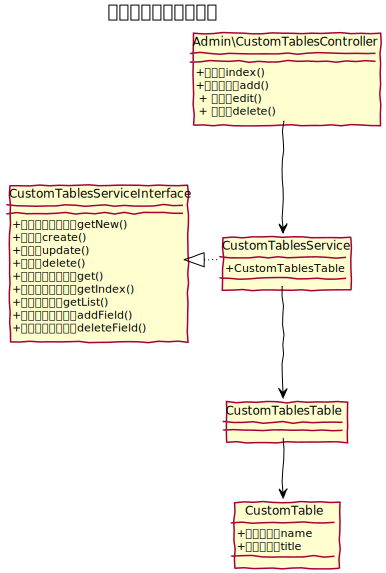
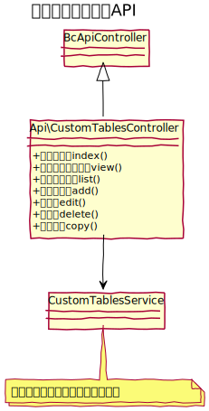

# カスタムテーブル設計

コンテンツ管理で利用できるコンテンツ、または、カテゴリやタグのマスターとして利用するためのテーブルを作成する事ができる。

## ユースケース図


## 機能
### 一覧表示
カスタムテーブルの一覧を表示する

### 新規登録
カスタムテーブルを新しく登録する。  
登録時にカスタムエントリーのDBテーブルを新規作成する。

```
# カスタムエントリーDBテーブルの命名規則
custom_entry_{カスタムテーブルID}_{カスタムテーブル識別名}
```
- **テーブルタイプ**: コンテンツ、マスタのどちらかを選択できる。コンテンツの場合は、カスタムコンテンツと関連づける事が可能となり、マスタの場合は、エントリーに対して階層構造を設定できる。
- **表示名称フィールド**: カスタムエントリーの操作を行った際に表示するメッセージなどで利用するエントリーを特定する表示名称フィールドを選択できる。

#### 初期フィールド
新規登録時には次のフィールドを初期フィールドとしてDBテーブルに追加する。ただし、タイプが group の場合は登録しない。
- id：ID
- name：スラッグ
- title：タイトル
- status：公開状態
- publish_begin：公開開始日
- publish_end：公開終了日
- created：作成日
- modified：編集日

### 編集
既存のカスタムテーブルの内容を更新する。  
識別名が変更となった場合は、DBテーブル名をリネームする。

#### 関連フィールド一覧
カスタムテーブルに関連するカスタムフィールドの一覧を表示する。  
group に所属する場合は、入れ子で表示する。  
関連フィールド詳細へのリンク、カスタムフィールドの編集画面へのリンクを表示する。

### 削除
既存のカスタムテーブルを削除する。  
削除時に次の処理を行う。
- 関連するDBテーブルの削除
- 関連フィールドの削除
- カスタムコンテンツの関連付けを解除

### フィールドとの関連付け
カスタムフィールドで定義したフィールドを複数関連付けることができ、タイトルの変更、並び替え、削除もできる。  
関連付けを追加した際には、カスタムエントリーのDBテーブルにカラムとして追加し、削除した場合は、対象カラムを削除する。  
リアルタイムでの処理ではなく、保存ボタンを押した際に一括で処理を行う。

### プレビュー
コンテンツ管理と連携している場合には、非公開状態の場合でもプレビューを確認することができる。

### 階層設定
関連するカスタムエントリーが階層化情報を持つかどうかを定義できる。

## ドメインモデル図


 
## クラス図
### 管理画面


　
### API

