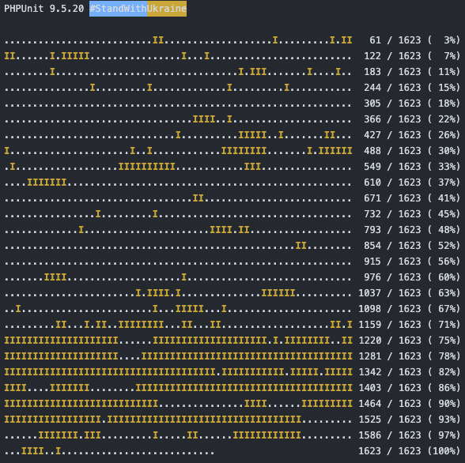

# 未実装のユニットテストに貢献する

まだまだ、未実装のテスト多く、実装が足りていません。（2022/04/24）  
未実装のテストを実装して頂けると非常に助かります。



- ドット（.）：成功したテスト
- アイ（I）：未実装のテスト
- エフ（F）：失敗したテスト
- イー（E）：エラーとなったテスト

　
## 未実装テスト一覧
未実装のテストの一覧は [未実装テスト一覧](https://docs.google.com/spreadsheets/d/1EGxMk-dy8WIg2NmgOKsS_fBXqDB6oJky9M0mB7TADEk/edit#gid=0&fvid=1581615779) から確認できます。

　
## ユニットテストに貢献する手順

### ローカルの開発環境を作る
[開発環境の構築](../preparation/environment) を参考に、Dockerでのローカル開発環境を作ります。

### テストの実装対象を決める
[未実装テスト一覧](https://docs.google.com/spreadsheets/d/1EGxMk-dy8WIg2NmgOKsS_fBXqDB6oJky9M0mB7TADEk/edit#gid=0&fvid=1581615779) よりテストの実装対象をピックアップします。  
なお、「_NotYetMigrated」というフォルダの中にあるクラスは、まだ全く移行できていないものになります。テストを実装する際は、まず、上位フォルダに移動します。

### ユニットテスト用のクラスを探す
ユニットテスト用のクラスは testsフォルダの同階層に配置します。  
存在する場合はそちらを利用し、ない場合は作成します。

```shell
/plugins/baser-core/src/Controller/AppController.php
　　　↓
/plugins/baser-core/tests/Controller/AppControllerTest.php
```

こちらも「_NotYetMigrated」フォルダの中に存在する場合があるので注意します。「_NotYetMigrated」の中にある場合はこちらを上位フォルダに移動して利用します。

### ブランチを切る
実装用のブランチを作成します。  
Issueが存在する場合はIssue番号をブランチ名に入れます（例：dev-#555）が、存在しない場合はおまかせします。  
（ユニットテストに関してはIssueを作ってもいいですし作らなくてもいいです）

```shell
git checkout -b branch-name
```

### ユニットテストを実装する
テストが未実装となっているクラスメソッドはほとんどの場合、本体の処理のCakePHP4への移行が完了していません。移行が完了していないものは、移行しながらユニットテストを実装していきます。
  
ユニットテストの実装仕様を検討する際、本体メソッドの仕様を読み解く必要がありますが、メソッドの意図などがわかりにくい場合は、無理せずスキップしましょう。
  
なお、正常系、異常系の両方が網羅できることが望ましいですが、まずは正常系の実装を目指してください。

詳細については、[ユニットテスト](./unittest.md) を参考にしてください。

### ユニットテストを実行する
```shell
# コンテナにログイン
cd docker
docker exec -it bc5-php /bin/bash

# テスト実行
# vendor/bin/phpunit ファイル名 --filter メソッド名
# （例）
vendor/bin/phpunit plugins/baser-core/tests/Controller/AppControllerTest.php --filter testConstruct
```


### アノテーションを付与する
なお、本体クラスのメソッドの上にアノテーションの記載があり、次を意味しています。実装状況に応じてアノテーションを付与します。  
（漏れがある場合は補完お願いします）

- @checked：一度チェックし動作を確認している
- @noTodo：残タスクが存在しない
- @note：残タスクを完了できない理由を記載
- @unitTest：ユニットテストの実装が完了している
- @doc：ユーザードキュメントへの記載が完了している

```php
/**
 * Initialize
 * @checked
 * @noTodo
 * @note(value="BcEmailを実装したあとに確認")
 * @unitTest
 * @doc
 */
public function initialize(): void
{
}
```

なお、アノテーションを付与する場合は、クラスファイルの冒頭に `use` 宣言が必要です。なければ記載してください。

```shell
use BaserCore\Annotation\NoTodo;
use BaserCore\Annotation\Note;
use BaserCore\Annotation\Checked;
use BaserCore\Annotation\UnitTest;
use BaserCore\Annotation\Doc;
```

### プルリクを送る
`dev` ブランチにプルリクエストを送ってください。  
マージされると、[未実装テスト一覧](https://docs.google.com/spreadsheets/d/1EGxMk-dy8WIg2NmgOKsS_fBXqDB6oJky9M0mB7TADEk/edit#gid=0&fvid=1581615779) にアノテーションが反映されます。

手順は以上です。

　
## ユニットテストで便利なメソッド

### リクエストを作成する
```php
$request = $this->getRequest('/baser/admin');
```
### ログイン状態を作る
```php
$this->adminLogin($request);
```
### APIにログインしアクセストークンを取得する
```php
$token = $this->apiLoginAdmin($id);
```
### プライベートメソッドを実行する
```php
$requestKey= $this->execPrivateMethod($this->PasswordRequest, 'makeRequestKey');
```
### イベントを設定する
```php
$this->attachEvent(['EventName' => ['callable' => function(Event $event) {
}]]);
```
```php
$this->entryEventToMock(self::EVENT_LAYER_CONTROLLER, 'BaserCore.Contents.searchIndex', function(Event $event) {
});
```
### イベントをリセットする
```php
$this->resetEvent();
```

