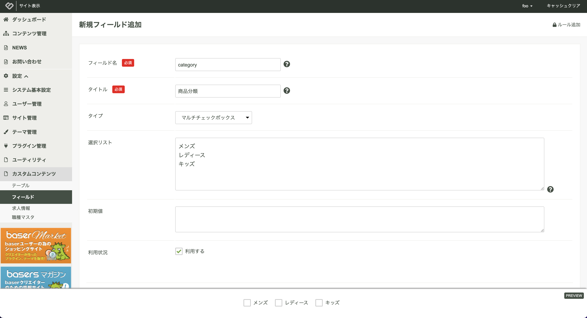
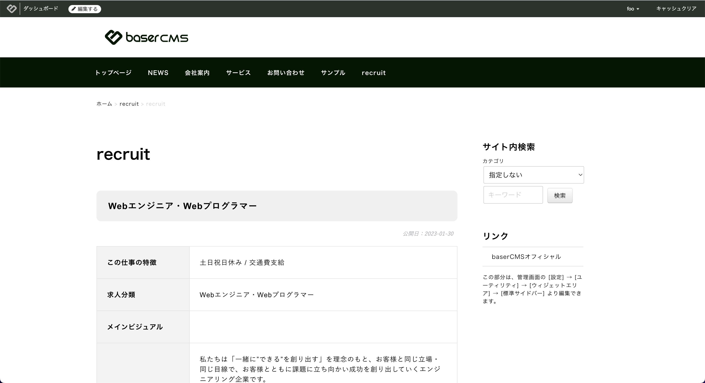
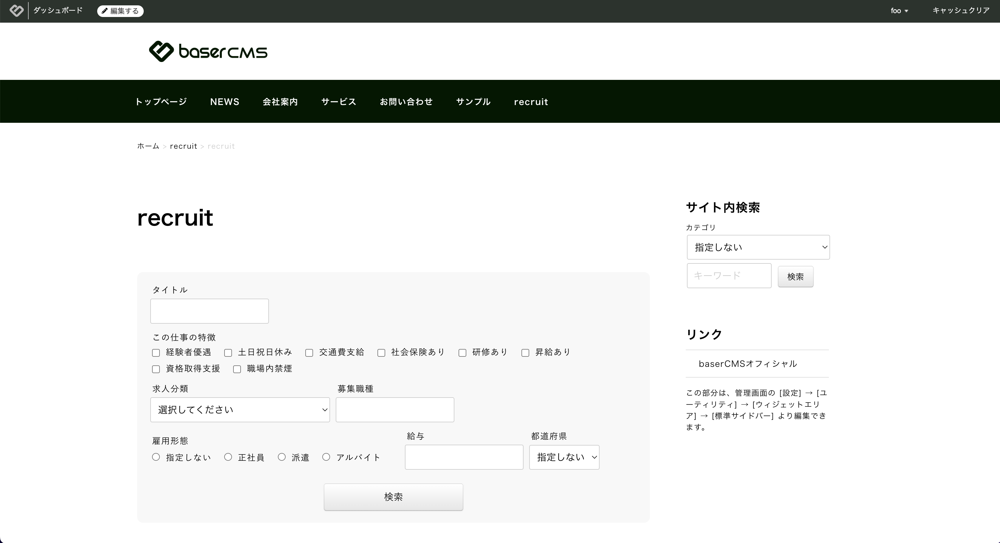

# カスタムコンテンツ

カスタムコンテンツとは、管理画面においてノーコードでオリジナルコンテンツのフィールドを定義し、そのコンテンツに対する管理機能とフロントエンドに表示するための仕組みを提供する機能です。  

管理画面から登録したデータはREST API で取得する事も可能です。これにより、baserCMS５はヘッドレスのデータAPIプラットフォームとして機能します。

## データ構成

データ構成については、[ER図](https://docs.google.com/presentation/d/1m8jAImToxjexulMhBlad6o0MUbRvpJ5r3Md-bdJztSA/edit#slide=id.g20e9de42a2a_0_0){:target="_blank"} をご覧ください。

カスタムフィールドでフィールドマスタを作成し、カスタムリンクで、でコンテンツのフィールド設計を行い、カスタムエントリーでそのコンテンツに対してのデータを登録します。

## WordPressのカスタムフィールドとの違い
WordPressのカスタムフィールドとの違いは、フィールド定義をレコードではなく、データベーステーブルのカラムとして作成するため、データベースのレコード量が少なく検索動作も高速となります。

## カスタムコンテンツの作成の流れ

1. プラグインをインストールする
2. カスタムフィールドを定義する
2. カスタムテーブルを作成する
3. カスタムテーブルとカスタムフィールドを紐付ける
4. コンテンツ管理でカスタムコンテンツを作成する
5. カスタムコンテンツとカスタムテーブルを紐付ける
6. カスタムエントリーを登録する
7. フロントページを確認する

### 1. プラグインをインストールする

設定 → プラグイン管理より、BcCustomContent（カスタムコンテンツ）のインストールボタンをクリックし、インストールを実行します。

設定メニューの中に「カスタムコンテンツ」が追加されます。

### 2. カスタムフィールドを定義する
カスタムフィールドとは、オリジナルのフィールドを定義できる機能です。

設定 → カスタムコンテンツ → フィールドより、フィールドの定義を行います。  


新規登録ボタンより新しいフィールドを定義します。  
タイプを選択し必要事項を入力すると画面下にコントロールのプレビューを表示します。



#### フィールドタイプ　
テキスト、テキストエリア、ラジオボタンなどのフィールドタイプは、プラグイン内直下の plugins ディレクトリ内で、個別にプラグインとして管理します。

【初期状態で提供するフィールド】
- 基本
  - Eメール / 隠しフィールド / パスワード / 電話番号 / テキスト / テキストエリア
- 日付
  - 日付（年月日） / 日付（年月日時間）
- 選択
  - チェックボックス / マルチチェックボックス / 都道府県リスト / ラジオボタン / 関連データ / セレクトボックス
- コンテンツ
  - ファイル（2023/02/23 未対応） / Wysiwygエディタ
- その他
  - グループ / 自動補完郵便番号

独自のカスタムフィールドをプラグインとして開発が可能です。

#### 入力チェック
エントリーにおける入力チェックとして次のものを提供します。
- **形式チェック**: Eメール、数値、半角英数、全角カタカナ、全角ひらがな、日付の形式チェック。
- **Eメール比較チェック**: 別のフィールドと値が同じかどうか確認する。
- **ファイルアップロードサイズ制限**: ファイルフィールドにおけるアップロードサイズの制限を指定できる。
- **ファイル拡張子チェック**: ファイルフィールドにおいてアップロードするファイルの拡張子を複数指定する事ができる。
 
#### 正規表現チェック
エントリーにおける入力チェックとして正規表現を指定したチェックができます。
なお、エラーとなった場合のエラーメッセージも設定できます。

#### 自動変換
エントリーにおける入力変換として次のもの選択できます。
- 半角変換
- 全角変換


### 3. カスタムテーブルを定義する
カスタムテーブルとは、コンテンツ管理で利用できるコンテンツテーブル、または、カテゴリやタグのマスターとして利用するためのマスターテーブルです。

設定 → カスタムコンテンツ → テーブルより、テーブルを作成します。

- **テーブルタイプ**: コンテンツ、マスタのどちらかを選択できます。コンテンツの場合は、カスタムコンテンツと関連づける事が可能となり、マスタの場合は、他のカスタムテーブルに紐付ける「関連データ」タイプとして、選択できるようになります。また、マスタの場合は、エントリーに対して階層構造を設定できます。
- **表示名称フィールド**: カスタムエントリーの操作を行った際に表示するメッセージなどで利用する表示名称フィールドを選択します。

なお、カスタムテーブルを作成すると、内部的に次の命名規則でデータベースのテーブルを自動生成します。

```
custom_entry_{カスタムテーブルID}_{カスタムテーブル識別名}
```

また、初期カラムとして次のカラムをデータベースのテーブルに自動追加します。ただし、
- id：ID
- name：スラッグ
- title：タイトル
- status：公開状態
- publish_begin：公開開始日
- publish_end：公開終了日
- created：作成日
- modified：編集日


新しいテーブル名入力して一度保存すると、テーブルとフィールドの紐付けができるようになります。  

「利用できるフィールド」に先ほど定義したカスタムフィールドの一覧が表示されていますので、必要なものを「利用中のフィールド」にドラッグアンドドロップで移動します。

「利用中のフィールド」における並び順が、管理画面のカスタムエントリー入力画面の並び順となりますので、適宜、ドラッグアンドドロップで並び順を入れ替えます。


なお、「利用中のフィールド」のフィールドの「設定」をクリックすると名称を変更できます。

また、「詳細編集」ボタンをクリックする事で、入力必須や、説明文、注意書き、前見出し、後見出しなど、管理画面のカスタムエントリー入力画面の表示に関わる部分の設定ができ、こちらも画面下部でプレビューを確認する事ができます。


- **グループ**: 所属するグループを指定します。
- **グループチェック**: グループでバリデーションを行います。グループフィールドの場合のみに表示します。
- **ループ機能を利用する**: エントリーの編集画面にてグループに所属するフィールドをセットとして連続的に登録できるようにする場合にチェックを入れます。
- **エントリー一覧に項目を表示する**: 管理画面のエントリー一覧にカラムとして表示する場合にチェックします。
- **入力欄の前に改行を入れる**: エントリーの編集画面にて入力欄の前にい改行を入れる場合にチェックします。 
- **入力欄の後に改行を入れる**: エントリーの編集画面にて入力欄の後に改行を入れる場合にチェックします。
- **テーマのヘルパーで呼び出せる**: テーマのヘルパーで呼び出せるようにする場合にチェックします。
- **Web API の返却値に含める**: Web APIの返却値に含める場合にチェックします。
- **管理画面において検索対象にする**: 管理画面において検索対象とする場合にチェックします。
- **テーマ、Web API において検索対象にする**: テーマ、Web API において検索対象とする場合にチェックします。

### 4. コンテンツ管理でカスタムコンテンツを作成する
作ったテーブルは、マスターメンテナンス用の管理画面としても利用する事ができますが、フロントページに表示するには、コンテンツ管理でカスタムコンテンツを作成し、テーブルと紐付ける必要があります

コンテンツ管理を開き、配置対象のフォルダを右クリックし、「カスタムコンテンツ」を選択します。


### 5. カスタムコンテンツとカスタムテーブルを紐付ける

カスタムコンテンツの編集画面を開き、「テーブル」にて先ほど作成したテーブルを選択し保存します。  
公開状態が「公開する」となっている場合、画面左のメニューにテーブル名を表示します。


- **テーブル**: コンテンツ管理に紐付けるテーブルを選択できます。テーブルタイプが「コンテンツ」となっているものを対象とします。
- **フロントのエントリー一覧の表示件数**:  フロントのエントリー一覧ページの表示件数を設定できます。
- **フロントのエントリー一覧の表示順**:  フロントのエントリー一覧ページの表示順を変更できます。
  - 並べ替え対象フィールド 
  - 昇順・降順
- **フロントに表示するウィジェットエリア**: フロントページにおいて表示するウィジェットを変更できます。
- **フロントで利用するコンテンツテンプレート**: フロントページにおいて利用するコンテンツテンプレートを変更できます。コンテンツテンプレートは、`templates/CustomContent/` に配置したフォルダを対象として一覧に表示します。  
- **フロントで利用するコンテンツテンプレートの編集画面に遷移する**: コンテンツテンプレートの編集画面へのリンクを表示します。（BcThemeFile プラグインがインストールされている場合に有効）

### 6. カスタムエントリーを登録する
先ほど表示された画面左のメニューからエントリーを選択するとカスタムエントリーの一覧を確認できます。


新規登録をクリックすると新しいカスタムエントリーの登録画面に遷移します。  
カスタムテーブルで定義したフィールドで入力画面が構成されている事を確認できます。


#### スラッグ
スラッグを利用するとURLにエントリーIDでなく、任意の文字列を利用する事ができます。なお、スラッグについては数値のみは利用できません。

```shell
# スラッグなし
/{カスタムコンテンツ名}/view/{記事NO}

# スラッグあり
/{カスタムコンテンツ名}/view/{スラッグ}
```

### 7. フロントページを確認する

ツールバーの「サイト確認」、または、プレビューをクリックする事でフロントページを確認できます。  
なお、こちらのレイアウトは、自動生成したものになっています。  
実際には、テンプレート上でフロントページ用のヘルパ関数を利用して自由に項目を配置する使い方を想定しています。




なお、パンくずの上位ページをクリックすると一覧も自動生成されている事が確認できます。  
初期状態では、検索項目も自動生成しています。



## テンプレート
カスタムコンテンツで設定したコンテンツテンプレートを利用します。
```shell
# default の場合
# 一覧
/templates/CustomContent/default/index.php
# 詳細
/templates/CustomContent/default/view.php
```

## ヘルパ
ヘルパを利用する事でエントリーのフィールドの値を取得する事ができます。
```php
echo $this->CustomContent->getFieldValue($entry, 'field_name');
```
ループフィールドを利用している場合の利用例は次のとおりです。
```php
// ループフィールドかどうか判定
$isLoop = $this->CustomContent->isLoop($customEntry, 'group_normal');
// 子のエントリーを取得
$entryChildren = $this->CustomContent->getFieldValue($customEntry, 'group_normal');
// 子のフィールド定義を取得
$linkChildren = $this->CustomContent->getLinkChildren($customEntry, 'group_normal');
if ($isLoop && $entryChildren && $linkChildren) {
    foreach($entryChildren as $entryChild) {
        foreach($linkChildren as $linkChild) {
            echo $this->CustomContent->getFieldValue($entryChild, $linkChild->name);
        }
    }
}
```


## WebAPI
カスタムエントリーは、WebAPIからも取得が可能です。  
（事前にWebAPIの有効化が必要です）

エンドポイントは次のとおりです。
```shell
# 一覧
/baser/api/bc-custom-content/custom_entries.json?custom_table_id=1
# 詳細
/baser/api/bc-custom-content/custom_entries/1.json?custom_table_id=1
```

必ず、クエリパラメータに `custom_table_id` を指定する必要があります。

　
## 独自のフィールドタイプを作成する

独自のフィールドタイプはプラグインとして開発します。

必要な最小構成は次のとおりです。

```shell
- config/
  - setting.php
- src/
  - View/
    - Helper/
      - {PluginName}Helper.php
  - Plugin.php
- config.php
```

### Pluginクラスを設置する
プラグインとして動作させるために、Pluginクラスを設置します。中身は空でも構いませんが `BcPlugin` を継承します。

```php
// /src/Plugin.php
namespace {PluginName};
use BaserCore\BcPlugin;
class Plugin extends BcPlugin{

}
```

### プラグイン情報を定義する
`type` に `BcCustomContentPlugin` を定義することで、カスタムコンテンツのプラグインとして認識できるようになります。
```php
// /config.php
return [
    'type' => ['BcCustomContentPlugin'],
    'title' => __d('baser_core', 'カスタムコンテンツ：TELフィールド'),
    'description' => __d('baser_core', 'カスタムコンテンツにTELフィールドを提供する'),
    'author' => 'baserCMS User Community',
    'url' => 'https://basercms.net',
];
```

### フィールドタイプを定義する
カスタムフィールドの編集画面にて「タイプ」として認識させるためには、対象プラグイン配下の `/config/setting.php` にタイプの設定を定義します。

`BcCustomContent.fieldTypes` 配下に、プラグイン名をキーとして定義します。つまり、プラグインごとに１つ定義できます。

```shell
return [
    'BcCustomContent' => [
        'fieldTypes' => [
            {PluginName} => [
                // 設定値を定義する
            ]
        ]
    ]
];        
```

#### 設定値
- `category`: タイプのセレクトボックスにおけるグループ（基本|日付|選択|コンテンツ|その他）
- `label`: 見出しラベル
- `columnType`: DBのカラム型
  CakePHPの ConnectionManager で認識できるもので指定
- `controlType`: コントロールのタイプ（検索時の条件生成などに利用）  
  CakePHPの FormHelper で認識できるもので指定
- `preview`: プレビューに対応しているかどうか（デフォルト false）
- `useDefaultValue`: 初期値の利用（デフォルト true）
- `useSize`: 横幅の利用（デフォルト false）
- `useMaxLength`: 最大文字数の利用（デフォルト false）
- `useAutoConvert`: 自動変換の利用（デフォルト false）
- `useCounter`: カウンターの利用（デフォルト false）
- `usePlaceholder`: プレースホルダーの利用（デフォルト false）
- `useCheckEmail`: Eメール形式チェックの利用（デフォルト false）
- `useCheckEmailConfirm`: Eメール比較チェックの利用（デフォルト false）
- `useCheckNumber`: 数値チェックの利用（デフォルト false）
- `useCheckHankaku`: 半角チェックの利用（デフォルト false）
- `useZenkakuKatakana`: 全角カタカナチェックの利用（デフォルト false）
- `useZenkakuHiragana`: 全角ひらがなチェックの利用（デフォルト false）
- `useCheckDatetime`: 日付チェックの利用（デフォルト false）
- `useCheckRegex`: 正規表現チェックの利用（デフォルト false）
- `useCheckMaxFileSize`: ファイルアップロードサイズ制限の利用（デフォルト false）
- `useCheckFileExt`: ファイル拡張子チェックの利用（デフォルト false）
- `loop`: ループ機能に対応しているかどうか（デフォルト false）

#### 設定例
```php
return [
    'BcCustomContent' => [
        'fieldTypes' => [
            'BcCcText' => [
                'category' => '基本',
                'label' => 'テキスト',
                'columnType' => 'string',
                'controlType' => 'text',
                'preview' => true,
                'useSize' => true,
                'useMaxLength' => true,
                'useAutoConvert' => true,
                'useCounter' => true,
                'usePlaceholder' => true,
                'useCheckEmail' => true,
                'useCheckEmailConfirm' => true,
                'useCheckNumber' => true,
                'useCheckHankaku' => true,
                'useCheckZenkakuKatakana' => true,
                'useCheckZenkakuHiragana' => true,
                'useCheckDatetime' => true,
                'useCheckRegex' => true,
                'useCheckMaxFileSize' => false,
                'useCheckFileExt' => false,
                'useDefaultValue' => true,
                'loop' => true
            ]
        ]
    ]
];
```

### ヘルパを定義する

４つのメソッドを定義します。

- **control**: 管理システムの編集画面で利用するコントロールを表示するためのメソッド。
- **preview**: リアルタイムプレビュー時の表示用メソッド。Vue.js の属性バインディングが利用できます。（必須ではありません）
- **searchControl**: 検索フォーム用のコントロールを表示するためのメソッド。（必須ではありません）
- **get**: テーマのテンプレートで表示するためのメソッド。

```php
// BcCcText の例
// /src/View/Helper/BcCcTexthelper
namespace BcCcText\View\Helper;

use BaserCore\View\Helper\BcAdminFormHelper;
use BcCustomContent\Model\Entity\CustomField;
use BcCustomContent\Model\Entity\CustomLink;
use Cake\View\Helper;

class BcCcTextHelper extends Helper
{

    public $helpers = [
        'BaserCore.BcAdminForm' => ['templates' => 'BaserCore.bc_form']
    ];

    public function control(CustomLink $link, array $options = []): string
    {
        $field = $link->custom_field;
        $options = array_merge([
            'type' => 'text',
            'size' => $field->size,
            'maxlength' => $field->max_length,
            'placeholder' => $field->placeholder
        ], $options);
        if (!empty($field->counter)) {
            $options['counter'] = true;
        }
        return $this->BcAdminForm->control($link->name, $options);
    }

    public function preview(CustomLink $link)
    {
        $options = [
            ':size' => 'entity.size',
            ':maxlength' => 'entity.max_length',
            ':placeholder' => 'entity.placeholder',
            ':value' => 'entity.default_value'
        ];
        return $this->control($link, $options);
    }

    public function searchControl(CustomLink $link, array $options = []): string
    {
        $options = array_merge([
            'size' => '',
            'max_length' => '',
            'placeholder' => ''
        ], $options);
        return $this->control($link, $options);
    }

    public function get($fieldValue, CustomLink $link, array $options = [])
    {
        return h($fieldValue);
    }

}
```
